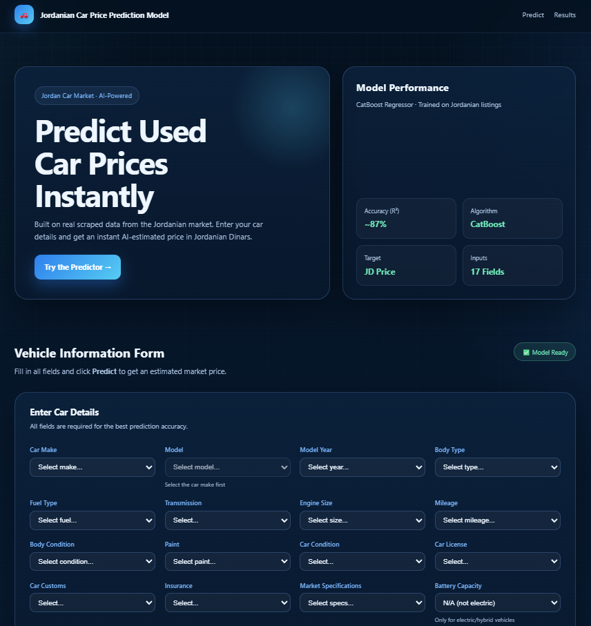

# 🚗 Jordanian Used Car Price Predictor

> An end-to-end machine learning web application that predicts used car prices in the Jordanian market — from data scraping to a live Flask web app.


---

## 📌 Overview

This project predicts the market price of used cars in Jordan based on 17 vehicle attributes. It was built entirely from scratch — starting with web scraping real listings from a Jordanian car marketplace, cleaning the data, training a CatBoost regression model, and finally deploying it as a Flask web application with a professional UI.

---

## ✨ Features

- 🔍 **Instant price prediction** — fill the form, click Predict, get a result in milliseconds
- 📊 **87% model accuracy** (R² score on test set)
- 🧠 **Smart ETL pipeline** — handles ordinal encoding, target encoding, one-hot encoding, and scaling automatically
- 🚘 **Dynamic dropdowns** — selecting a Car Make instantly filters the available Models
- 💰 **Price range output** — shows estimated price + a ±10% confidence interval
- 🇯🇴 **Jordan-specific** — trained on real local listings with Jordanian Dinar (JD) output

---

## 🖼️ Screenshots


---

## 🗂️ Project Structure

```
car_price_app/
│
├── app.py                  # Flask backend — routes + ETL pipeline
├── car_price_model.pkl     # Trained CatBoost model
├── requirements.txt        # Python dependencies
│
├── templates/
│   └── index.html          # Frontend — form + results UI
│
└── static/                 # (optional) CSS / JS assets
```

And the Jupyter notebook used for the full ML pipeline:

```
DataCleaningSteps.ipynb     # EDA → cleaning → feature engineering → training
```

---

## 🔬 Machine Learning Pipeline

### 1. Data Collection
- Scraped thousands of used car listings from a Jordanian marketplace (OpenSooq)
- Fields collected: make, model, year, mileage, fuel type, body type, condition, price, and more

### 2. Data Cleaning
- Handled missing values using group-wise mode/median imputation
- Dropped irrelevant columns (color, neighborhood, trim, etc.)
- Filtered outliers in the price column

### 3. Feature Engineering

| Feature | Method |
|---|---|
| `Car Age` | `current_year - model_year` |
| `Brand Value` | Target encoding (median log-price per make) |
| `Model Value` | Target encoding (median log-price per model) |
| `Fuel Type`, `Body Type`, etc. | One-hot encoding |
| `Mileage`, `Body Condition`, `Paint`, etc. | Ordinal encoding |
| `Car Age`, `Brand Value`, `Model Value` | StandardScaler |

- **Target variable**: `log1p(Price)` — log-transformed for better distribution, reversed with `expm1()` at prediction time

### 4. Models Compared

| Model | R² Score |
|---|---|
| Linear Regression | ~0.70 |
| Ridge / Lasso | ~0.71 |
| Random Forest | ~0.83 |
| XGBoost | ~0.82 |
| **CatBoost** ✅ | **~0.87** |

### 5. Final Model
```python
CatBoostRegressor(
    iterations=3000,
    learning_rate=0.03,
    depth=6,
    l2_leaf_reg=5,
    early_stopping_rounds=200,
    loss_function='RMSE'
)
```

---

## 🌐 Web Application

Built with **Flask** — no database required. The app works as a pure **input → predict → output** pipeline.

### How a prediction works:
```
User fills form (17 fields)
        ↓
Browser sends JSON to POST /predict
        ↓
Flask runs the ETL pipeline on the input
        ↓
CatBoost predicts log1p(price)
        ↓
np.expm1() converts back to JD price
        ↓
Browser displays: price + range + label
```

### Input Fields

| Field | Type |
|---|---|
| Car Make | Dropdown |
| Model | Dynamic dropdown (filtered by make) |
| Model Year | Dropdown |
| Body Type | Dropdown |
| Fuel Type | Dropdown |
| Transmission | Dropdown |
| Engine Size | Dropdown |
| Mileage | Dropdown |
| Body Condition | Dropdown |
| Paint | Dropdown |
| Car Condition | Dropdown |
| Car License | Dropdown |
| Car Customs | Dropdown |
| Insurance | Dropdown |
| Market Specifications | Dropdown |
| Battery Capacity | Dropdown (EVs only) |
| Battery Range | Dropdown (EVs only) |

---

## 🚀 Run Locally

### 1. Clone the repository
```bash
git clone https://github.com/your-username/jordan-car-price-predictor.git
cd jordan-car-price-predictor/car_price_app
```

### 2. Install dependencies
```bash
pip install -r requirements.txt
```

### 3. Run the app
```bash
python app.py
```

### 4. Open in browser
```
http://127.0.0.1:5000
```

---

## ☁️ Deploy Online (Free)

### Option A — PythonAnywhere *(easiest for beginners)*
1. Create a free account at [pythonanywhere.com](https://www.pythonanywhere.com)
2. Upload all files via the Files tab
3. Go to **Web** → **Add new web app** → **Flask**
4. Point it to `app.py`
5. Your app is live at `yourname.pythonanywhere.com`

### Option B — Render.com
1. Push this repo to GitHub
2. Go to [render.com](https://render.com) → **New Web Service** → connect your repo
3. Set **Start Command**: `gunicorn app:app`
4. Set **Build Command**: `pip install -r requirements.txt`
5. Deploy 🎉

### Option C — Railway.app
```bash
pip install railway
railway init
railway up
```

---

## 🛠️ Tech Stack

| Layer | Technology |
|---|---|
| Language | Python 3.10+ |
| Web Framework | Flask |
| ML Model | CatBoost |
| Data Processing | Pandas, NumPy |
| Preprocessing | Scikit-learn |
| Model Serialization | Joblib |
| Frontend | HTML, CSS, Vanilla JS |
| Data Source | OpenSooq (Jordan) |

---

## 📈 Results

| Metric | Value |
|---|---|
| R² Score | ~0.87 |
| MAE | ~1,890 JD |
| RMSE | ~4,387 JD |

---

## 🔮 Future Improvements

- [ ] Add Arabic language toggle for Jordanian users
- [ ] Save prediction history with SQLite
- [ ] Add confidence score from model
- [ ] Retrain model periodically with fresh scraped data
- [ ] Add a price trend chart by make/model/year
- [ ] API endpoint for third-party integration

---

## 👨‍💻 Author

Built by **[Your Name]** — a machine learning project for the Jordanian used car market.

- GitHub: [@your-username](https://github.com/your-username)
- LinkedIn: [your-linkedin](https://linkedin.com/in/your-linkedin)

---

## 📄 License

This project is open source and available under the [MIT License](LICENSE).
